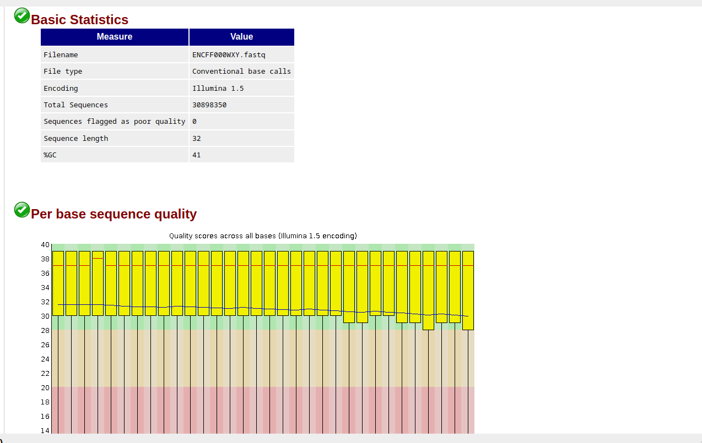

# hse22_hw4
Работа выполнена в [google colab](colab.research.google.com/drive/1LB6Z6LbvVIE0fSaO7avrRbR6Pp25Ils6?usp=sharing).

## FASTQC reports
Control

ENCF002AAX

ENCF002AAZ

[control](src/ENCFF000WXY_fastqc.html) 
[ENCFF002AAX](src/ENCFF002AAX_fastqc.html) 
[ENCFF002AAZ](src/ENCFF002AAZ_fastqc.html)

Сокращенная информация по подрезанным чтениям:

[ENCFF002AAX](src/ENCFF002AAX.fastq.trim_fastqc.html)
[ENCFF002AAZ](src/ENCFF002AAZ.fastq.trim_fastqc.html)
